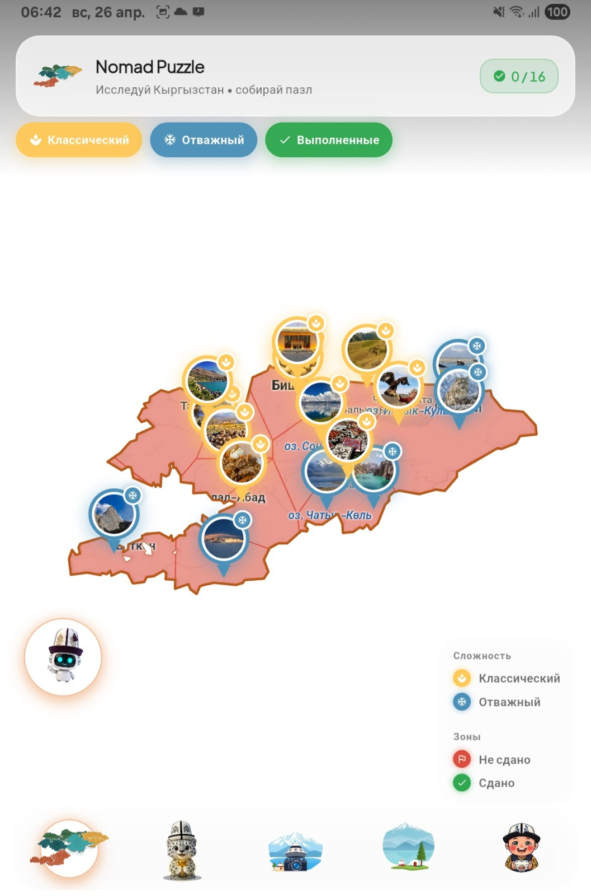

# Nomad Puzzle

Туристическое приложение для Кыргызстана: интерактивная карта зон,
геймификация (квесты с подтверждением фотоснимком), каталог авторских туров с
датами заездов, профиль кочевника и AI-ассистент Жел Айдар с поддержкой голоса.

## Демо

https://github.com/user-attachments/assets/692cff78-4362-49f4-93d5-5bc7d7f83511

<p align="center">
  
</p>

Локальные копии демо в репозитории:

- [`docs/demo.mp4`](docs/demo.mp4) — 2.4 MB, 480p
- [`docs/demo-hd.mp4`](docs/demo-hd.mp4) — 42 MB, 640×480 (HD)

## О проекте

Nomad Puzzle помогает путешественнику открыть для себя Кыргызстан в формате
"пазла": каждая зона на карте — кусочек страны, который собирается, когда ты
там побывал и подтвердил визит. Параллельно пользователь может бронировать
авторские туры, общаться с AI-проводником и прокачивать профиль кочевника.

### Что внутри

- **Карта Кыргызстана** — flutter_map с разметкой зон по сложности
  (Классический / Отважный) и статусу (сдано / не сдано / в процессе).
  Кастомные пин-маркеры с обложкой места, фильтр-чипы, легенда и плавающий
  заголовок-стекло.
- **Квесты** — список челленджей, детали с описанием, фотоподтверждение
  визита через камеру или галерею, авто-сабмит на бэкенд.
- **Камера** — отдельный экран съёмки/выбора фото, привязка к челленджу.
- **Туры** — каталог из `/api/v1/catalog/tours`, детали с программой по дням,
  проживанием, included/excluded, датами заездов, локациями и ценой.
- **AI-чат "Жел Айдар"** — сессии с историей, оптимистичная отправка с
  pending-индикатором, голосовой ввод (long-press на микрофон → запись →
  Whisper транскрипция), TTS-озвучка ответов (Piper). Доступ из любой страницы
  через плавающий FAB, который автоматически прячется при модальных окнах.
- **Профиль** — данные пользователя из `/api/v1/users/me`, аватар (загрузка),
  статистика (квесты / туры / отзывы), форма редактирования, баннер подписки.
- **Подписка (демо)** — три тарифа (Кочевник / Путник / Хан) с локальным
  переключением до подключения платежей.

### Архитектура

Clean Architecture по фиче, BLoC + GoRouter, DI через `get_it` + `injectable`,
сериализация через `json_serializable`. Каждая фича разделена на:
`domain/` (entities, repositories, usecases) → `data/` (models, datasources,
repository_impl) → `presentation/` (bloc, pages, widgets).

```
lib/
├── core/
│   ├── auth/                 # хранилище токенов
│   ├── di/                   # injectable DI
│   ├── errors/               # Failure / Exception
│   ├── network/              # Dio, interceptors, ApiConstants
│   ├── router/               # GoRouter, ScaffoldWithNav, FabVisibility
│   ├── theme/                # AppColors, AppTheme
│   └── widgets/              # переиспользуемые виджеты (LottieIcon, ChatFab, …)
└── features/
    ├── auth/
    ├── ai_chat/
    ├── camera/
    ├── challenges/
    ├── map/
    ├── profile/
    ├── subscription/
    └── tours/
```

### Стек

| Слой | Пакеты |
|------|---------|
| State | `flutter_bloc`, `equatable` |
| Routing | `go_router` |
| DI | `get_it`, `injectable` |
| Network | `dio`, `pretty_dio_logger`, `dartz` |
| Storage | `shared_preferences`, `flutter_secure_storage` |
| Codegen | `build_runner`, `freezed`, `json_serializable`, `injectable_generator` |
| UI | `flutter_animate`, `lottie`, `cached_network_image`, `shimmer`, `confetti`, `google_fonts` |
| Map | `flutter_map`, `latlong2` |
| Camera/Voice | `camera`, `image_picker`, `record`, `audioplayers`, `permission_handler` |
| Utils | `intl`, `path_provider` |

### Бэкенд

Параметризован через `lib/core/network/api_constants.dart`. По умолчанию
`https://parallel.airun.kg`. Используются разделы swagger:

- `auth` — `/api/v1/auth/{login,register,refresh,logout}`
- `users` — `/api/v1/users/me{,/avatar,/profile,/submissions,/bookings,/reviews}`
- `challenges` — `/api/v1/challenges/{...}`
- `catalog` — `/api/v1/catalog/tours{,/{id},/{id}/departures}`
- `agent` — `/api/v1/agent/sessions{,/{id},/{id}/messages}`
- `voice` — `/api/v1/voice/{transcribe,synthesize}`

Полная схема: `https://parallel.airun.kg/swagger/index.html`.

## Запуск

```bash
# 1. Поставить зависимости
flutter pub get

# 2. Сгенерировать код (json_serializable + injectable)
dart run build_runner build --delete-conflicting-outputs

# 3. Запустить на устройстве
flutter run
```

## Сборка релиза

Подпись настроена через `android/key.properties` (gitignored). После создания
keystore сборка обычная:

```bash
flutter build apk --release         # APK для теста
flutter build appbundle --release   # AAB для Google Play
```

iOS — обычный flow Xcode (`Runner.xcworkspace`).

## Минимальные требования

- Flutter SDK `^3.11.5`
- Dart `^3.4`
- Android `minSdk` определяется Flutter, target актуальный
- iOS 12+

## Лицензия

Внутренний учебный проект, лицензия не публичная.
